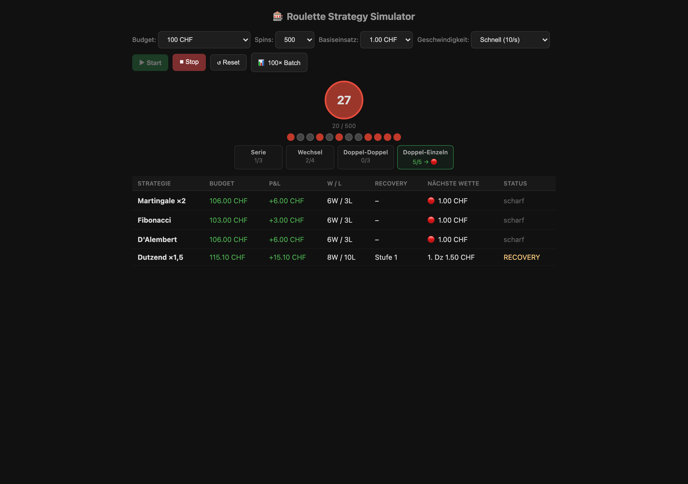

# 🎰 Roulette Strategy Simulator

**Ein Simulator, der zeigt, warum Wettsysteme den Hausvorteil nicht schlagen — Martingale, Fibonacci & Co. über tausende simulierte Spins nebeneinander.**
_A simulator that shows why betting systems can't beat the house edge — Martingale, Fibonacci & co. compared over thousands of simulated spins._

---

## 🇩🇪 Deutsch

### Was ist das?
Ein reiner Mathematik-/Wahrscheinlichkeits-Simulator. Er lässt mehrere bekannte Roulette-Wettsysteme (Martingale, Fibonacci, D'Alembert, Dutzend-Leiter) parallel gegen denselben Zufalls-Spin-Verlauf antreten und zeigt live Budget, Gewinn/Verlust, Trefferquote und Recovery-Status. Zusätzlich erkennt er Muster im Verlauf (Serien, Wechsel, Blöcke).

### Warum habe ich das gebaut?
Wettsysteme klingen verführerisch — „verdopple nach jedem Verlust, dann kannst du nicht verlieren". Das stimmt mathematisch nicht: der Hausvorteil bleibt, und irgendwann trifft die Verlustserie das Budget-Limit. Ich wollte das **sichtbar** machen, statt es nur zu behaupten. Über tausende Spins sieht man selbst, wie jedes System langfristig gegen die Wand läuft. Ein kleines Wochenend-/Spaßprojekt über Erwartungswert und Zufall.

### Wie funktioniert es?
- **Reiner Simulator:** lokaler Zufallsgenerator (`Math.random`), keine echte Seite, kein echtes Geld, keine Anbindung an irgendein Casino.
- **Strategie-Engine:** jedes System als eigene Einsatz-Logik, alle laufen auf demselben Spin-Verlauf.
- **Muster-Erkennung:** erkennt Serien / Wechsel / Blöcke im Ergebnis-Stream.
- **Single-File:** eine HTML + eine JS-Datei, kein Build, öffnet direkt im Browser.

## 🇬🇧 English

### What is it?
A pure maths/probability simulator. It runs several well-known roulette betting systems (Martingale, Fibonacci, D'Alembert, dozen-ladder) in parallel against the same random spin history and shows live budget, P&L, hit rate and recovery status. It also detects patterns in the stream (streaks, alternations, blocks).

### Why I built it
Betting systems sound seductive — "double after every loss and you can't lose". Mathematically that's false: the house edge remains and eventually a losing streak hits your budget limit. I wanted to make that **visible** rather than just assert it. Over thousands of spins you watch every system fail in the long run. A small weekend project about expected value and randomness.

### How it works
- **Pure simulator:** a local random generator (`Math.random`), no real site, no real money, no connection to any casino.
- **Strategy engine:** each system is its own staking logic, all running on the same spin history.
- **Pattern detection:** identifies streaks / alternations / blocks in the result stream.
- **Single-file:** one HTML + one JS file, no build — opens directly in the browser.

---

## Tech
`Vanilla JS` · `HTML/CSS` — kein Build, keine Abhängigkeiten / no build, no dependencies

## Nutzen / Run
Einfach `index.html` im Browser öffnen. / Just open `index.html` in a browser.

> ⚠️ Dies ist ein Lern-/Demo-Projekt über Wahrscheinlichkeit. Es demonstriert gerade, dass Wettsysteme **nicht** funktionieren. / This is an educational/demo project about probability — it specifically demonstrates that betting systems do **not** work.
